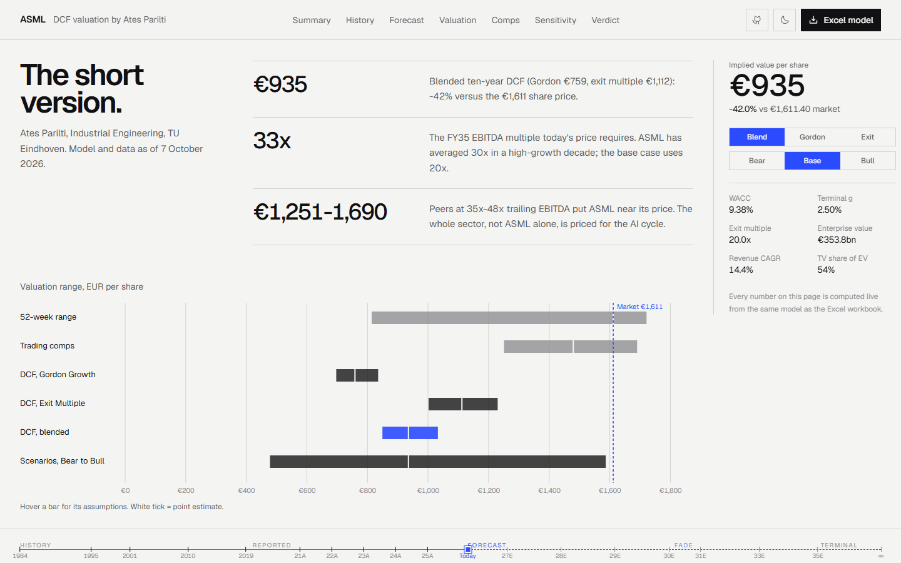
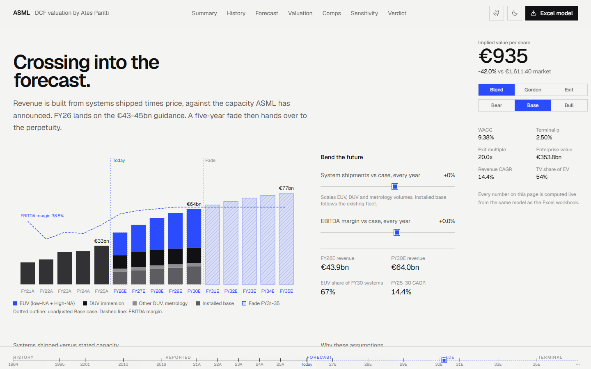

<div align="center">

# ASML Holding N.V. — DCF Valuation

**A ten-year discounted cash flow valuation of ASML, built from reported filings, checked against peers, and published as an interactive site.**

[**Live site**](https://atesparilti1.github.io/asml-dcf-valuation/) · [**Excel model**](ASML_DCF_Model.xlsx) · [**Full report**](docs/ASML_Valuation_Report.md) · [**Interview notes**](docs/Interview_Prep.md)




</div>

---

## Result

| | EUR per share | vs €1,611.40 |
|---|---:|---:|
| **DCF, blended (headline)** | **€935** | **(42%)** |
| DCF, Gordon Growth (g 2.5%) | €759 | (53%) |
| DCF, Exit Multiple (20x FY35 EBITDA) | €1,112 | (31%) |
| Trading comps (peer EV / LTM EBITDA, 35-48x) | €1,251 - €1,690 | (22%) to +5% |
| Scenarios: Bear / Base / Bull | €478 / €935 / €1,587 | |
| 52-week trading range | €814 - €1,721 | |

**Conclusion.** Relative to its peers, ASML is priced in line with the sector. On its own cash flows it looks **overvalued**. A reverse DCF shows today's price needs a **33x** FY35 EBITDA multiple or **7.1%** growth in perpetuity after 2035. The market is pricing the AI equipment cycle as if the growth phase lasts well beyond a ten-year forecast. Only the Bull case (110 low-NA and 32 High-NA EUV systems by 2030) comes close to the share price.

## What's inside

| | |
|---|---|
| **Revenue build** | FY26-30 revenue = systems shipped x average selling price for low-NA EUV, High-NA EUV and DUV immersion, plus other DUV, metrology and installed base. Units are checked against ASML's stated capacity (~65 EUV and ~130 DUV immersion in 2026, +30% planned for 2027). FY26 lands inside the €43-45bn guidance. |
| **Ten-year horizon** | Five explicit years, then a five-year **fade** (FY31-35) where growth steps down linearly to the 2.5% terminal rate. Terminal value is 54% (Gordon) to 69% (Exit) of EV. |
| **WACC 9.38%** | 10Y Bund 3.51%, bottom-up semiconductor-equipment beta 1.40, Damodaran ERP 4.23%. The regression beta against the STOXX Europe 600 (1.79, R² 0.33) is shown as a cross-check. |
| **Two terminal methods + reverse DCF** | Gordon Growth and Exit Multiple, each cross-checked through the other's implied multiple or growth rate. |
| **Trading comps** | Applied Materials, Lam Research, KLA, Tokyo Electron: EV/EBITDA, forward P/E, margins. ASML's own FY21-25 year-end EV/EBITDA averaged 29.8x. |
| **Stress tests** | 9x9 sensitivity grids (WACC x g, WACC x multiple, blended), Bear/Base/Bull scenarios each built bottom-up, football field. |
| **Integrity** | 27 automated checks (EV and equity bridge reconcile, units within capacity, FY26 within guidance, fade ends at g, sensitivity centre = model price, scenario engine = main model, monotonic responses). `verify_model.py` recalculates every formula independently. |

## Historical analysis (FY2021-FY2025, € m)

| | FY21 | FY22 | FY23 | FY24 | FY25 |
|---|---:|---:|---:|---:|---:|
| Revenue | 18,611 | 21,173 | 27,559 | 28,263 | 32,667 |
| Growth | 33.1% | 13.8% | 30.2% | 2.6% | 15.6% |
| Gross margin | 52.7% | 50.5% | 51.3% | 51.3% | 52.8% |
| EBITDA margin | 38.8% | 33.5% | 35.5% | 35.2% | 37.7% |
| Effective tax rate | 15.2% | 15.0% | 15.8% | 18.6% | 17.7% |
| CapEx % revenue | 5.1% | 6.2% | 8.0% | 7.4% | 5.0% |
| NWC % revenue | (23.7%) | (32.2%) | (13.5%) | (23.6%) | (27.3%) |
| Unlevered FCF | 10,018 | 7,192 | 3,055 | 9,135 | 10,951 |
| Year-end EV / EBITDA | 39.7x | 27.9x | 27.2x | 26.1x | 28.3x |

## Forecast (Base case)

| € m | FY26E | FY27E | FY28E | FY29E | FY30E | FY35E (fade) |
|---|---:|---:|---:|---:|---:|---:|
| Low-NA EUV systems x ASP | 65 x €255m | 75 x €260m | 82 x €265m | 86 x €270m | 88 x €275m | |
| High-NA EUV systems | 8 | 10 | 14 | 18 | 22 | |
| DUV immersion systems | 130 | 145 | 150 | 145 | 140 | |
| **Revenue** | **43,931** | **50,468** | **56,293** | **60,408** | **64,008** | **77,422** |
| Growth | 34.5% | 14.9% | 11.5% | 7.3% | 6.0% | 2.5% |
| EBITDA margin | 41.0% | 42.0% | 42.5% | 43.0% | 43.0% | 43.0% |
| Unlevered FCF | 9,010 | 15,743 | 17,616 | 18,897 | 19,932 | 23,813 |



## Repository

| Path | What it is |
|---|---|
| [`ASML_DCF_Model.xlsx`](ASML_DCF_Model.xlsx) | The model: Cover, Assumptions, Historical, Revenue Build, Forecast, WACC, DCF, Sensitivity, Scenarios, Comps, Dashboard, Checks. Inputs blue on yellow; everything else is a formula. Saved with calculated values so previews show numbers. |
| [`data/inputs.py`](data/inputs.py) | Every input with its type (Reported / Market / Derived / Assumption) and source |
| [`build_model.py`](build_model.py) | Generates the workbook from the inputs and exports data for the site |
| [`model.py`](model.py) | Independent Python implementation of the same model |
| [`verify_model.py`](verify_model.py) | Recalculates every Excel formula, matches it to `model.py` in all three scenarios, scans calculation tabs for hard-coded numbers |
| [`web/`](web) | The interactive site (React, Motion, Tailwind, D3 scales); the same model in TypeScript, with parity tests |
| [`docs/`](docs) | [Valuation report](docs/ASML_Valuation_Report.md), [interview notes](docs/Interview_Prep.md), [CV and portfolio text](docs/CV_and_Portfolio.md) |

```bash
pip install openpyxl formulas
python build_model.py && python verify_model.py     # rebuild and verify the workbook
cd web && npm install && npm test && npm run dev    # run the site locally
```

## Sources
ASML Form 20-F 2025 and SEC XBRL data (FY20-FY25); ASML Q4-25 and Q2-26 results (guidance, capacity, 28-Jun-26 balance sheet); Euronext prices and STOXX Europe 600 via Yahoo Finance; 10Y Bund (Trading Economics); Damodaran ERP and industry betas (Jan 2026); peer trading data (stockanalysis.com, 7-8 Oct 2026). Full list with links in the [report](docs/ASML_Valuation_Report.md#11-sources).

## Skills demonstrated
Financial statement analysis (US GAAP) · bottom-up revenue modelling · unlevered FCF · CAPM / WACC and beta estimation · Gordon Growth and exit-multiple terminal values · fade periods · reverse DCF · trading comparables · EV-to-equity bridge · stub-period and mid-year discounting · sensitivity and scenario analysis · Excel model design and audit checks · Python automation · React data visualisation.

---

<sub>By [Ates Parilti](https://www.linkedin.com/in/atesparilti/), Industrial Engineering, TU Eindhoven. Educational project, not investment advice. Historical figures come from ASML's public filings; forecasts and the valuation are the author's own assumptions.</sub>
